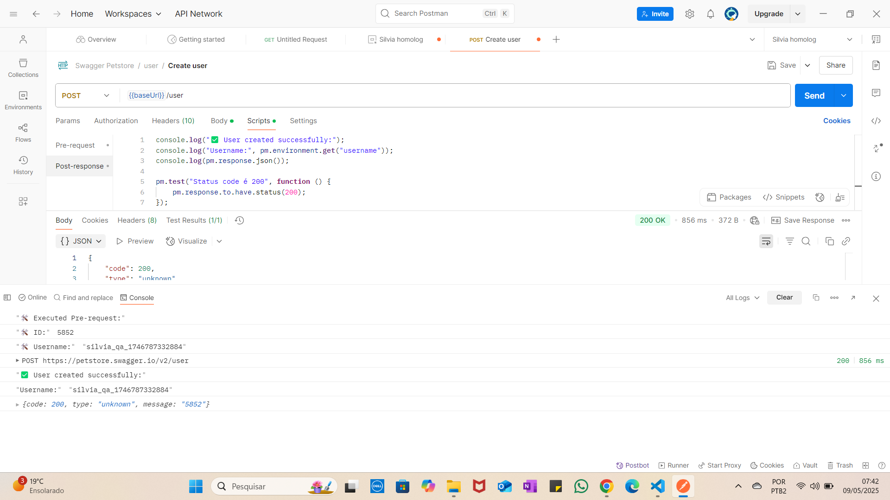

# 🧪 API Testing – Swagger Petstore with Postman

This project demonstrates basic **CRUD operations** using **Postman**, based on the public API [Swagger Petstore](https://petstore.swagger.io/).

## ✅ Exercise 1 – Create User (POST /user)

This test creates a new user with **dynamic `id` and `username`**, generated in the **Pre-request Script**.

### 🔧 Pre-request Script

```javascript
let randomId = Math.floor(Math.random() * 9900) + 100;
let timestamp = new Date().getTime();
let username = `silvia_qa_${timestamp}`;

pm.environment.set("userId", randomId);
pm.environment.set("username", username);

console.log("🛠️ Executed Pre-request:");
console.log("🛠️ ID:", randomId);
console.log("🛠️ Username:", username);
```

### 📦 Body (JSON)

```json
{
  "id": {{userId}},
  "username": "{{username}}",
  "firstName": "Silvia",
  "lastName": "Test",
  "email": "silvia@biovitta.com",
  "password": "123456",
  "phone": "11999999999",
  "userStatus": 1
}
```

### ✅ Tests

```javascript
console.log("✅ User created successfully:");
console.log("Username:", pm.environment.get("username"));
console.log(pm.response.json());

pm.test("Status code is 200", function () {
    pm.response.to.have.status(200);
});
```

### 📸 Postman Console Output



---

## 📁 Included Files

- `collection.json` – Exported Postman collection
- `README.md` – Exercise documentation (this file)

---

## 🚀 Upcoming Exercises

- [ ] Read user data (GET)
- [ ] Update user (PUT)
- [ ] Delete user (DELETE)

Stay tuned for more updates! 🧪✨
